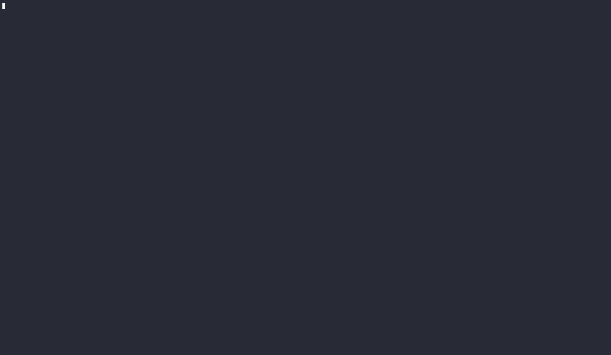

# ki - KIND Interactive

[](https://github.com/zdk/ki/actions/workflows/test-coverage.yml)
[](https://goreportcard.com/report/github.com/zdk/ki)
[](https://codecov.io/gh/zdk/ki)

A wrapper for kind - use kind interactively



## Prerequisites

- [Go](https://golang.org/doc/install) 1.21 or later.
- [KIND](https://kind.sigs.k8s.io/docs/user/quick-start/#installation) installed and accessible in PATH.
- [Docker](https://docs.docker.com/get-docker/) running.

## Installation

### From Source

```bash
git clone https://github.com/zdk/ki.git
cd ki
go build -o ki .
sudo mv ki /usr/local/bin/
```

## Usage

Simply run the `ki` command to start:

```bash
ki
```

### Keyboard Shortcuts

| Key              | Action            |
| ---------------- | ----------------- |
| `↑/k`            | Move up           |
| `↓/j`            | Move down         |
| `←/h`            | Go back           |
| `→/l` or `Enter` | Select            |
| `c`              | Create cluster    |
| `d`              | Delete cluster    |
| `r`              | Refresh           |
| `i`              | Show cluster info |
| `n`              | Show nodes        |
| `l`              | Load image        |
| `b`              | Build image       |
| `L`              | Export logs       |
| `?`              | Toggle help       |
| `q` or `Ctrl+C`  | Quit              |

#### Creating a New Cluster

1. Launch `ki`
2. Press `c` to create a cluster
3. Enter cluster name
4. Wait for creation to complete

#### Loading an Image

1. Select a cluster from the list
2. Press `l` to load an image
3. Enter the image name (e.g., `myapp:latest`)
4. Image will be loaded into the selected cluster

#### Viewing Cluster Details

1. Select a cluster
2. Press `i` to view cluster information
3. Press `n` to view nodes in the cluster

## Development

### Running Tests

```bash
# Run all tests
go test ./...

# Run tests with coverage
go test -cover ./...

# Run specific package tests
go test ./internal/ui/models/
```

### Building

```bash
# Build for current platform
go build -o ki .

# Build for multiple platforms
GOOS=linux GOARCH=amd64 go build -o ki-linux-amd64 .
GOOS=darwin GOARCH=amd64 go build -o ki-darwin-amd64 .
GOOS=windows GOARCH=amd64 go build -o ki-windows-amd64.exe .
```
